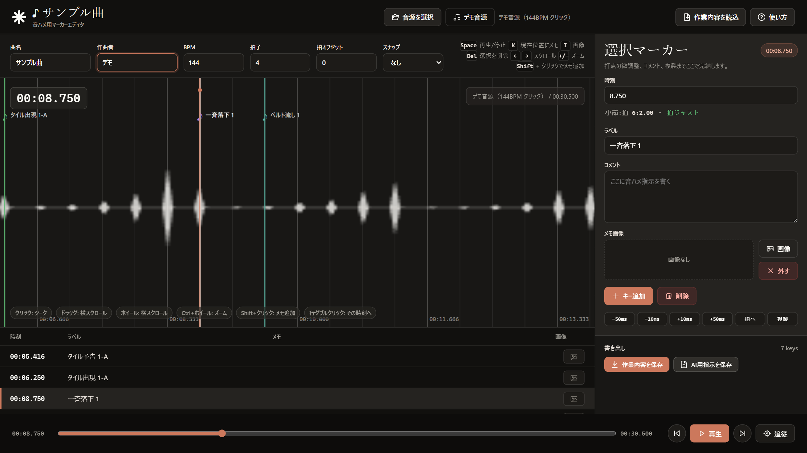
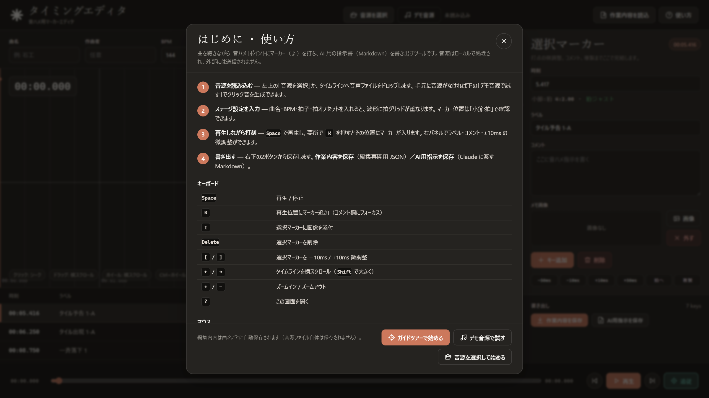
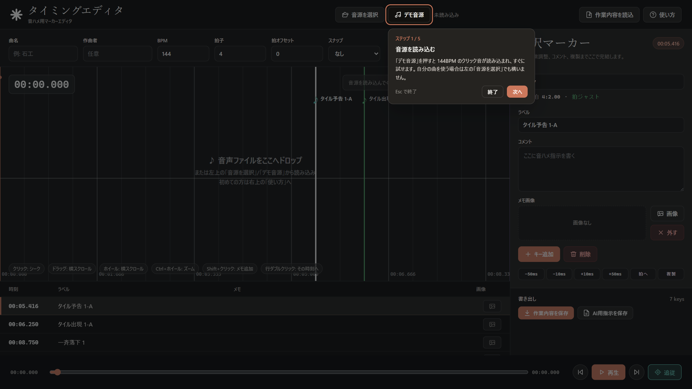
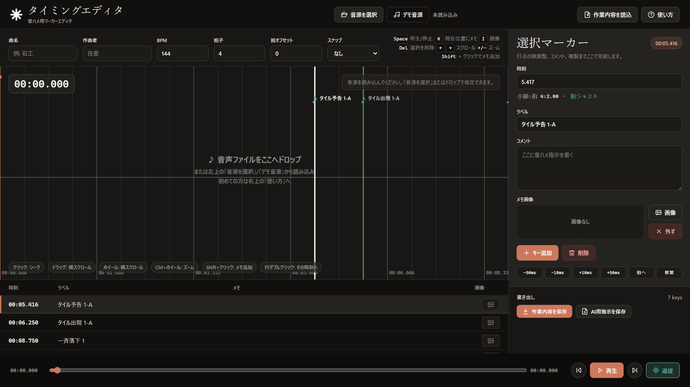
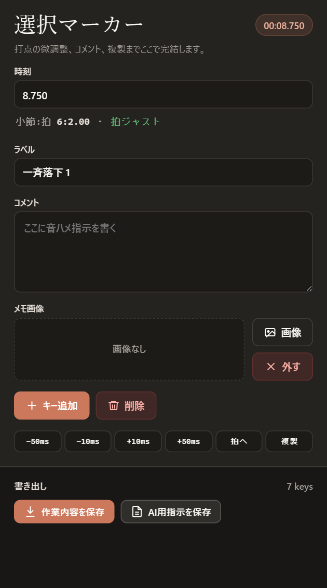

# タイミングエディタ

ステージ楽曲の「音ハメ」ポイントにマーカー（♪）を打ち、Claude に渡す指示書 Markdown を
書き出すためのツールです。任意のステージで使えます。



## 3ステップで始める

1. `index.html` をブラウザ（Chrome / Edge 推奨）で開く。サーバ・インストールは不要です。
2. 左上の「**音源を選択**」で音声ファイルを読み込む。手元に音源がなければ「**デモ音源**」で
   144BPM のクリック音を生成してすぐ試せます。
3. <kbd>Space</kbd> で再生し、要所で <kbd>K</kbd> を押して打刻 → 右下から書き出し。

音源や画像はローカルで処理され、外部には送信されません。

## はじめての方へ

初回起動時はガイドツアーが自動で始まり、実際の画面上で操作を順番に案内します
（2回目以降は自動表示されません）。基本の流れとキー操作をまとめた「使い方」モーダルは、
右上の「**使い方**」ボタン、または <kbd>?</kbd> キーでいつでも開けます。



### ガイドツアー

初回起動時に自動で始まるほか、使い方モーダルの「**ガイドツアーで始める**」からも
いつでも開始できます。実際の画面上で「次に押すボタン」をスポットライトと吹き出しで
順番に案内します（デモ音源の読み込み → 再生 → 打刻 → 微調整 → 書き出し、の5ステップ）。
実際に操作すると自動で次のステップへ進みます。



- <kbd>Esc</kbd> または吹き出しの「終了」でいつでも中断できます。中断したツアーが
  次回起動時に勝手に再開することはありません。
- 中断しても <kbd>?</kbd> →「ガイドツアーで始める」で続きから再開できます
  （達成済みのステップは自動でスキップ）。
- 「次へ」で操作せずに読み進めることもできます。

音源を読み込む前のタイムラインにも、次にやることが表示されます。



## 基本フロー

1. **音源を読み込む** … 「音源を選択」ボタン、またはタイムラインへ音声ファイルをドロップ。
2. **ステージ設定を入力** … ツールバーの以下を埋める（各欄にカーソルを合わせると説明が出ます）:
   - **曲名**（例: 石工）… タイトル（`♪ 曲名`）・指示書見出しに使用。
     ファイル名と自動保存キーもこの曲名から自動導出します（使用不可文字・空白はハイフンに、
     空欄なら `stage`）。
   - **作曲者**（任意）… 空なら指示書の「（作曲: …）」は省略
   - **BPM / 拍子 / 拍オフセット** … 波形上の拍グリッド基準。拍オフセットで小節頭を合わせる
3. **再生しながら打刻** … <kbd>Space</kbd> で再生し、要所で <kbd>K</kbd> を押してマーカー（♪）を追加。
   波形上の位置は右パネルの「小節:拍」「拍ジャスト / 拍から ±ms」で確認できます。
4. **メモを記入** … 右パネルでラベル・コメントを編集(入力は自動反映)。
   <kbd>I</kbd> で選択マーカーに画像を添付できます。
5. **書き出す** … 右下パネルの2ボタンを使い分けます（下表）。
6. **リポジトリへ保存** … 書き出した Markdown を `Instructions/{曲名}-timing-instructions.md`
   として保存し、Claude に渡します（画像はチャットに別途添付）。

### 右パネル（マーカー編集と書き出し）



### 書き出しファイル 2種

| ボタン | ファイル名 | 用途 |
|---|---|---|
| **作業内容を保存** | `{曲名}-timing-markers.json` | 編集を再開するための JSON（画像込み）。ヘッダーの「作業内容を読込」で復元 |
| **AI用指示を保存** | `{曲名}-timing-instructions.md` | Claude に渡す Markdown 指示書 |

## キーバインド

キー操作はテキスト入力欄にフォーカスしていないときに有効です。

| キー | 動作 |
|---|---|
| `Space` | 再生 / 停止 |
| `K` | 再生位置にマーカー追加（コメント欄にフォーカス） |
| `I` | 選択マーカーに画像を添付 |
| `Delete` / `Backspace` | 選択マーカーを削除 |
| `[` / `]` | 選択マーカーを −10ms / +10ms 微調整 |
| `←` / `→` | タイムラインを横スクロール（`Shift` で大きく移動） |
| `+` / `=` / `-` | ズームイン / ズームアウト |
| `?` | 使い方モーダルを開く（`Esc` で閉じる。ガイドツアー中の `Esc` はツアー終了） |

マウス操作:

- **クリック**: その位置へシーク　/　**Shift+クリック**: その位置にマーカー追加
- **ドラッグ**・**ホイール**: タイムライン横スクロール　/　**Ctrl（⌘）+ホイール**: ズーム
- **マーカーをドラッグ**: 時刻を移動　/　**再生ヘッド付近をドラッグ**: スクラブ
- **一覧の行をクリック**: 選択　/　**ダブルクリック**: その時刻へジャンプ

## スクロールと追従

- 再生中は **再生ヘッドへのエッジ追従** で表示域が進みます（ヘッドが表示域の右 70% を
  超えると、ヘッドが左 30% に来る位置へスクロール）。中央固定ではないので先の波形を見やすいです。
- ドラッグ・ホイール・`←` `→` で手動スクロールすると追従は自動的に解除されます。
- フッターの「**追従**」ボタンで ON / OFF を切り替えられます（ON = シアン）。再生を押すと
  自動的に追従 ON に戻ります。

## 自動保存

- 編集内容（マーカー・設定）は **曲名から導出したキー単位** で `localStorage` に自動保存されます
  （変更の約1秒後）。次回起動時に、前回のデータを自動復元します。
- **音源ファイル自体は保存されません。** 復元後は音源を読み込み直してください。
- 別ステージ／別 PC へ引き継ぐときは「作業内容を保存」の JSON で書き出して共有します。

## デモ音源について

「デモ音源」ボタン（ヘッダー / 使い方モーダル）は、144BPM・4/4 のクリック音
（小節頭はアクセント、18小節 ≒ 30秒）をブラウザ内で合成して読み込みます。
初期状態のサンプルマーカーは 144BPM の拍上にあるため、そのまま拍グリッドと一致します。
打刻や書き出しの練習用で、音源ファイルを用意しなくても一通りの操作を試せます。

## 指示書の書式について

- `秒` 列は Unity 側 `BulletBuffer` の発火 / `appearTime` の基準に対応させる値です。
- `小節:拍` は BPM グリッド上の位置（1始まり）、`間隔` は直前マーカーからの差（秒 / 拍数）。
- 表・見出しの書式は Claude への指示パイプラインが依存しているため、そのまま渡してください。

## 開発者向け: 動作検証

`tools/verify.mjs` で、ブラウザ実機（システムの Chrome）による自動検証と
README 用スクリーンショットの再生成ができます。

```powershell
cd tools
npm install   # 初回のみ（playwright-core を取得）
node verify.mjs
```

チェック内容: 書き出し2フォーマットの回帰比較（git HEAD 版との一致）、削除済み UI
（チャート雛形・プレビュー）が存在しないこと、初回訪問でのガイドツアー自動開始
（モーダルは出ない）と中断後の再訪問で自動再表示されないこと、`?` からのモーダル表示と
ツアー手動開始〜完了（デモ音源 → 再生 → 打刻 → 微調整 → 保存、中断と再開を含む）、
再訪問時の非表示。
